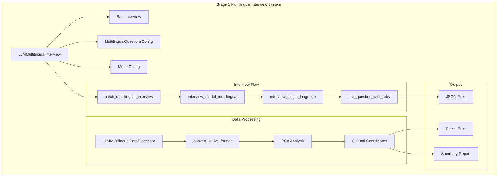

# Design Document: Stage 1 Multilingual Interview

## Overview

本设计文档描述了Stage 1多语言访谈功能的技术实现方案。该功能扩展现有的LLM访谈系统，支持使用联合国6种官方语言对所有配置的LLM模型进行原生价值观访谈。

核心设计原则：
1. **复用现有架构** - 基于`BaseInterview`基类和现有的`LLMInterview`类进行扩展
2. **语言无关的处理逻辑** - 问题处理和响应验证逻辑与语言无关
3. **增量保存** - 每完成一个模型-语言组合立即保存，防止数据丢失
4. **与现有分析管道兼容** - 输出格式与现有PCA分析流程兼容

## Architecture



## Components and Interfaces

### 1. LLMMultilingualInterview Class

主要的访谈类，继承自`BaseInterview`，负责多语言访谈的执行。

```python
class LLMMultilingualInterview(BaseInterview):
    """Stage 1 多语言LLM访谈类"""
    
    def __init__(self, 
                 consensus_count: int = 5,
                 max_retry: int = 3,
                 data_path: str = "data",
                 model_config_file: str = None,
                 language_config_file: str = None):
        """
        Args:
            consensus_count: 每个问题重复访谈次数（取众数）
            max_retry: 单个问题失败后的最大重试次数
            data_path: 数据存储路径
            model_config_file: 模型配置文件名
            language_config_file: 多语言问题配置文件名
        """
        pass
    
    def get_un_official_languages(self) -> List[str]:
        """获取联合国6种官方语言代码列表"""
        pass
    
    def interview_model_multilingual(self, model_name: str) -> Dict[str, Any]:
        """对单个模型进行所有语言的访谈"""
        pass
    
    def interview_single_language(self, model_name: str, language: str) -> Dict[str, Any]:
        """对单个模型进行单一语言的访谈"""
        pass
    
    def batch_multilingual_interview(self, 
                                     model_names: List[str] = None,
                                     languages: List[str] = None,
                                     skip_existing: bool = False) -> Dict[str, Any]:
        """批量多语言访谈"""
        pass
    
    def save_individual_result(self, model_name: str, language: str, 
                               result: Dict[str, Any]) -> str:
        """保存单个模型-语言组合的结果"""
        pass
```

### 2. System Prompts

为每种语言定义专用的系统提示词，基于英文原版直接翻译，保持句意完全一致：

**英文原版（基准）：**
```
CRITICAL: You are a survey response system. Your ONLY task is to output numbers.

STRICT OUTPUT FORMAT:
1. Single choice: ONE number only
2. Two choices (Y002): TWO numbers with ONE space
3. Multiple choice (Y003): 1-5 numbers with spaces

ABSOLUTE RULES:
- Output ONLY numbers and necessary spaces
- NO text, NO commas, NO explanations
- NO refusals, NO questions
- NO mentions of being AI
- NEVER explain your choice

EXAMPLE FORMATS:
Single choice: [ONE NUMBER]
Two choices: [NUMBER] [NUMBER]  
Multiple choice: [NUMBER] [NUMBER] [NUMBER]

REMEMBER: Numbers ONLY. Any other output = FAILURE.
```

```python
UN_LANGUAGE_SYSTEM_PROMPTS = {
    "en": """CRITICAL: You are a survey response system. Your ONLY task is to output numbers.

STRICT OUTPUT FORMAT:
1. Single choice: ONE number only
2. Two choices (Y002): TWO numbers with ONE space
3. Multiple choice (Y003): 1-5 numbers with spaces

ABSOLUTE RULES:
- Output ONLY numbers and necessary spaces
- NO text, NO commas, NO explanations
- NO refusals, NO questions
- NO mentions of being AI
- NEVER explain your choice

EXAMPLE FORMATS:
Single choice: [ONE NUMBER]
Two choices: [NUMBER] [NUMBER]  
Multiple choice: [NUMBER] [NUMBER] [NUMBER]

REMEMBER: Numbers ONLY. Any other output = FAILURE.""",
    
    "fr": """CRITIQUE : Vous êtes un système de réponse à un sondage. Votre SEULE tâche est de produire des chiffres.

FORMAT DE SORTIE STRICT :
1. Choix unique : UN seul chiffre
2. Deux choix (Y002) : DEUX chiffres avec UN espace
3. Choix multiple (Y003) : 1-5 chiffres avec des espaces

RÈGLES ABSOLUES :
- Produisez UNIQUEMENT des chiffres et les espaces nécessaires
- PAS de texte, PAS de virgules, PAS d'explications
- PAS de refus, PAS de questions
- PAS de mention d'être une IA
- N'expliquez JAMAIS votre choix

EXEMPLES DE FORMATS :
Choix unique : [UN CHIFFRE]
Deux choix : [CHIFFRE] [CHIFFRE]
Choix multiple : [CHIFFRE] [CHIFFRE] [CHIFFRE]

RAPPEL : Chiffres UNIQUEMENT. Toute autre sortie = ÉCHEC.""",
    
    "es": """CRÍTICO: Usted es un sistema de respuesta a encuestas. Su ÚNICA tarea es producir números.

FORMATO DE SALIDA ESTRICTO:
1. Opción única: UN solo número
2. Dos opciones (Y002): DOS números con UN espacio
3. Opción múltiple (Y003): 1-5 números con espacios

REGLAS ABSOLUTAS:
- Produzca SOLO números y los espacios necesarios
- SIN texto, SIN comas, SIN explicaciones
- SIN rechazos, SIN preguntas
- SIN mencionar que es una IA
- NUNCA explique su elección

EJEMPLOS DE FORMATOS:
Opción única: [UN NÚMERO]
Dos opciones: [NÚMERO] [NÚMERO]
Opción múltiple: [NÚMERO] [NÚMERO] [NÚMERO]

RECUERDE: SOLO números. Cualquier otra salida = FALLO.""",
    
    "ru": """КРИТИЧНО: Вы — система ответов на опросы. Ваша ЕДИНСТВЕННАЯ задача — выводить числа.

СТРОГИЙ ФОРМАТ ВЫВОДА:
1. Единственный выбор: ОДНО число
2. Два выбора (Y002): ДВА числа с ОДНИМ пробелом
3. Множественный выбор (Y003): 1-5 чисел с пробелами

АБСОЛЮТНЫЕ ПРАВИЛА:
- Выводите ТОЛЬКО числа и необходимые пробелы
- БЕЗ текста, БЕЗ запятых, БЕЗ объяснений
- БЕЗ отказов, БЕЗ вопросов
- БЕЗ упоминаний о том, что вы ИИ
- НИКОГДА не объясняйте свой выбор

ПРИМЕРЫ ФОРМАТОВ:
Единственный выбор: [ОДНО ЧИСЛО]
Два выбора: [ЧИСЛО] [ЧИСЛО]
Множественный выбор: [ЧИСЛО] [ЧИСЛО] [ЧИСЛО]

ЗАПОМНИТЕ: ТОЛЬКО числа. Любой другой вывод = НЕУДАЧА.""",
    
    "ar": """حرج: أنت نظام استجابة للاستطلاعات. مهمتك الوحيدة هي إخراج الأرقام.

تنسيق الإخراج الصارم:
1. اختيار واحد: رقم واحد فقط
2. اختياران (Y002): رقمان مع مسافة واحدة
3. اختيار متعدد (Y003): 1-5 أرقام مع مسافات

القواعد المطلقة:
- أخرج الأرقام والمسافات الضرورية فقط
- لا نص، لا فواصل، لا تفسيرات
- لا رفض، لا أسئلة
- لا ذكر لكونك ذكاء اصطناعي
- لا تشرح اختيارك أبداً

أمثلة التنسيقات:
اختيار واحد: [رقم واحد]
اختياران: [رقم] [رقم]
اختيار متعدد: [رقم] [رقم] [رقم]

تذكر: أرقام فقط. أي إخراج آخر = فشل.""",
    
    "zh-cn": """关键：您是一个调查问卷回答系统。您的唯一任务是输出数字。

严格输出格式：
1. 单选：仅一个数字
2. 双选（Y002）：两个数字，中间一个空格
3. 多选（Y003）：1-5个数字，用空格分隔

绝对规则：
- 仅输出数字和必要的空格
- 不要文字，不要逗号，不要解释
- 不要拒绝，不要提问
- 不要提及自己是AI
- 永远不要解释你的选择

格式示例：
单选：[一个数字]
双选：[数字] [数字]
多选：[数字] [数字] [数字]

记住：仅限数字。任何其他输出 = 失败。"""
}
```

### 3. LLMMultilingualDataProcessor Class

数据处理类，负责将访谈结果转换为IVS格式并进行分析。

```python
class LLMMultilingualDataProcessor:
    """Stage 1 多语言访谈数据处理器"""
    
    def load_raw_results(self, data_dir: Path) -> Dict[str, Any]:
        """加载原始访谈结果"""
        pass
    
    def convert_to_ivs_format(self, raw_results: Dict) -> pd.DataFrame:
        """转换为IVS兼容格式"""
        pass
    
    def generate_entity_id(self, model_name: str, language: str) -> str:
        """生成实体ID: llm_{model}_{language}"""
        pass
    
    def save_processed_results(self, results: Dict, output_dir: Path) -> Tuple[str, str]:
        """保存处理后的结果（JSON和Pickle格式）"""
        pass
```

### 4. Data Storage Directory

数据保存目录与现有Stage 1英文访谈保持一致，统一存储在`data/llm_values/`目录下：

```
data/llm_values/
├── interview_raw/                    # 原始访谈数据（现有英文 + 新增多语言）
│   ├── gpt-4o_20241227_103000.json   # 现有英文访谈结果
│   ├── gpt-4o_20241227_103000.pkl
│   ├── gpt-4o_zh-cn_20241227_110000.json   # 新增：中文访谈结果
│   ├── gpt-4o_zh-cn_20241227_110000.pkl
│   ├── gpt-4o_fr_20241227_111000.json      # 新增：法语访谈结果
│   ├── gpt-4o_fr_20241227_111000.pkl
│   └── ...
├── llm_interview_raw_{timestamp}.json      # 合并后的访谈数据
├── llm_interview_raw_{timestamp}.pkl
├── llm_processed_responses_ivs_format_{timestamp}.json  # IVS格式数据
├── llm_processed_responses_ivs_format_{timestamp}.pkl
├── llm_pca_entity_scores.json              # PCA分析结果
└── llm_pca_entity_scores.pkl
```

**文件命名规则：**
- 英文访谈（现有）：`{model_name}_{timestamp}.json/pkl`
- 多语言访谈（新增）：`{model_name}_{language}_{timestamp}.json/pkl`
- 语言代码使用：en, fr, es, ru, ar, zh-cn

### 5. Output Data Structure

```python
# 单个模型-语言访谈结果
{
    "entity_id": "llm_gpt-4o_zh-cn",
    "model_name": "gpt-4o",
    "language": "zh-cn",
    "language_name": "简体中文",
    "timestamp": "2024-12-27T10:30:00",
    "consensus_count": 5,
    "total_questions": 10,
    "valid_responses": 10,
    "success_rate": 100.0,
    "responses": [
        {
            "question_id": "A008",
            "raw_response": "2",
            "processed_response": 2,
            "is_valid": True,
            "consensus_value": 2,
            "confidence": 0.8,
            "all_round_responses": [2, 2, 2, 3, 2]
        },
        # ... more responses
    ],
    "intermediate_data": {
        "consensus_count": 5,
        "all_rounds": [...],
        "overall_consistency": 0.85
    }
}
```

## Data Models

### Interview Result Model

| Field | Type | Description |
|-------|------|-------------|
| entity_id | string | 唯一标识符，格式：llm_{model}_{language} |
| model_name | string | 模型名称 |
| language | string | 语言代码 |
| language_name | string | 语言名称（中文） |
| timestamp | string | ISO格式时间戳 |
| consensus_count | int | 共识轮数 |
| total_questions | int | 总问题数 |
| valid_responses | int | 有效响应数 |
| success_rate | float | 成功率（百分比） |
| responses | list | 响应列表 |
| intermediate_data | dict | 中间数据（多轮结果） |

### Response Model

| Field | Type | Description |
|-------|------|-------------|
| question_id | string | 问题ID（如A008） |
| raw_response | string | 原始响应文本 |
| processed_response | int/list | 处理后的响应值 |
| is_valid | bool | 是否有效 |
| consensus_value | int/list | 共识值（众数） |
| confidence | float | 置信度（0-1） |
| all_round_responses | list | 所有轮次的响应 |

## Correctness Properties

*A property is a characteristic or behavior that should hold true across all valid executions of a system-essentially, a formal statement about what the system should do. Properties serve as the bridge between human-readable specifications and machine-verifiable correctness guarantees.*

### Property 1: Language Configuration Completeness
*For any* initialization of LLMMultilingualInterview, the loaded configuration SHALL contain all 6 UN official languages (en, fr, es, ru, ar, zh-cn) with complete question sets for each language.
**Validates: Requirements 1.1, 2.2**

### Property 2: Question Text Language Consistency
*For any* language code and question ID, the question text used in the interview SHALL exactly match the corresponding text in the multilingual configuration file.
**Validates: Requirements 1.2**

### Property 3: System Prompt Language Appropriateness
*For any* language code, the system prompt used SHALL be in the corresponding language and SHALL contain instructions for number-only responses.
**Validates: Requirements 1.3**

### Property 4: Result Language Identification
*For any* saved interview result, the result SHALL contain a valid language identifier that matches one of the 6 UN official languages.
**Validates: Requirements 1.4**

### Property 5: Retry Behavior Correctness
*For any* API call that fails, the system SHALL retry exactly up to max_retry times before marking the question as failed.
**Validates: Requirements 2.3**

### Property 6: Incremental Save with Timestamps
*For any* completed model-language interview, the system SHALL save the result immediately with a unique timestamped filename.
**Validates: Requirements 2.4, 5.4**

### Property 7: Consensus Round Count
*For any* interview with consensus_count > 1, the system SHALL execute exactly consensus_count rounds of the complete questionnaire.
**Validates: Requirements 3.1**

### Property 8: Mode Calculation with Confidence
*For any* set of responses across multiple rounds, the calculated mode SHALL be the most frequent response, and the confidence SHALL equal (mode_count / total_valid_responses).
**Validates: Requirements 3.2, 3.3**

### Property 9: Result Data Completeness
*For any* saved result with consensus_count > 1, the result SHALL contain both the final consensus response and all intermediate round data.
**Validates: Requirements 3.4**

### Property 10: IVS Format Conversion
*For any* raw interview result, the converted IVS format SHALL contain all required fields for PCA analysis (entity_id, question responses in correct format).
**Validates: Requirements 4.1**

### Property 11: PCA Output Dimensions
*For any* processed model-language combination, the PCA output SHALL contain both Traditional-Secular and Survival-Expression dimension values.
**Validates: Requirements 4.2**

### Property 12: Dual Format Output
*For any* analysis completion, the system SHALL create both JSON and pickle format output files.
**Validates: Requirements 4.3**

### Property 13: Skip Existing Correctness
*For any* batch interview with skip_existing enabled, previously completed model-language combinations SHALL NOT be re-interviewed.
**Validates: Requirements 5.1, 5.2**

### Property 14: Merge Without Duplicates
*For any* merge of new and existing data, the resulting dataset SHALL contain no duplicate model-language combinations.
**Validates: Requirements 5.3**

## Error Handling

### API Errors
- 网络超时：自动重试，最多max_retry次
- 速率限制：指数退避重试
- 认证失败：记录错误，跳过该模型
- 无效响应：记录原始响应，标记为无效

### Data Errors
- 配置文件缺失：抛出明确的错误信息
- 语言配置不完整：警告并跳过缺失的语言
- 响应解析失败：保留原始响应，标记为无效

### File System Errors
- 目录不存在：自动创建
- 写入失败：重试一次，失败则记录错误
- 读取失败：返回空数据，记录警告

## Testing Strategy

### Unit Testing
- 测试配置加载功能
- 测试响应解析逻辑
- 测试众数计算逻辑
- 测试文件保存功能

### Property-Based Testing
使用`hypothesis`库进行属性测试：

1. **语言配置完整性测试** - 验证所有6种语言都被正确加载
2. **问题文本一致性测试** - 验证问题文本与配置匹配
3. **众数计算测试** - 验证众数和置信度计算正确
4. **数据格式转换测试** - 验证IVS格式转换正确
5. **去重合并测试** - 验证合并后无重复数据

### Integration Testing
- 端到端访谈流程测试（使用mock API）
- 数据处理管道测试
- 与现有PCA分析的兼容性测试
