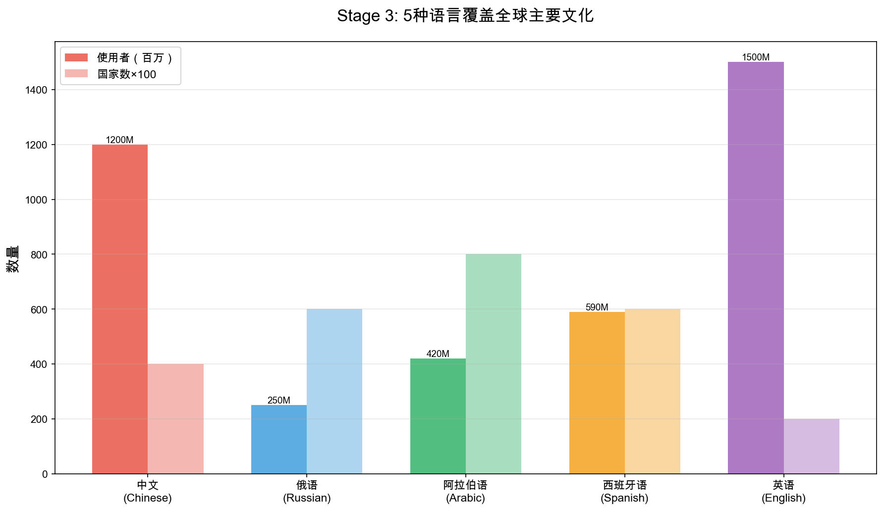

# Stage 3 学术展示 HTML Slide 使用指南

## 📁 文件结构

```
slides/stage3/
├── stage3_academic_presentation.html  # 主展示文件
├── images/                             # 所有图表
│   ├── chart_1_language_coverage.png
│   ├── chart_2_84_percent_paradox.png
│   ├── chart_3_china_example.png
│   ├── chart_4_top_countries.png
│   ├── chart_5_model_comparison.png
│   ├── chart_6_language_regions.png
│   └── chart_7_overall_summary.png
└── README_使用指南.md                  # 本文件
```

## 🚀 快速开始

### 方法1: 直接打开（推荐）

```bash
# 在浏览器中打开
open slides/stage3/stage3_academic_presentation.html

# 或者使用任何浏览器直接打开该文件
```

### 方法2: 本地服务器（可选）

如果需要更好的体验，可以启动本地服务器：

```bash
# 在项目根目录
cd "/Users/yxy/code/LLM's values/slides/stage3"

# Python 3
python3 -m http.server 8000

# 然后在浏览器访问
# http://localhost:8000/stage3_academic_presentation.html
```

## ⌨️ 快捷键

### 导航
- **→** 或 **空格**: 下一页
- **←**: 上一页
- **Home**: 第一页
- **End**: 最后一页

### 功能
- **Esc** 或 **O**: 概览模式（显示所有 slides）
- **F**: 全屏模式
- **S**: 演讲者模式（显示备注）
- **B** 或 **.**: 黑屏暂停
- **?**: 显示所有快捷键

## 📊 Slide 内容概览

### 14张核心 Slides：

1. **标题页** - 研究主题和基本信息
2. **Stage 1 回顾** - LLM本身价值观
3. **Stage 2 回顾** - 英语环境跨文化理解
4. **Stage 3 设计** - 多语言实验设计
5. **评估方法** - 文化距离计算
6. **核心发现** - 84.6%英语悖论
7. **中国案例** - 47%英语优势详解
8. **各国排名** - 英语优势排名
9. **模型对比** - 7个模型表现
10. **理论解释** - 三个假设
11. **研究贡献** - 学术与实践价值
12. **局限与未来** - 研究局限和方向
13. **总结** - 核心结论
14. **致谢** - 联系方式

## 🎨 自定义修改

### 修改内容

直接编辑 `stage3_academic_presentation.html`，主要部分：

```html
<!-- 修改标题页信息 -->
<section class="title-slide">
    <h1>多语言对比与"英语悖论"</h1>
    <p>汇报人: [您的姓名]</p>  <!-- 在这里修改 -->
</section>

<!-- 修改联系方式 -->
<section class="center">
    <p>[您的邮箱]</p>  <!-- 在这里修改 -->
    <p>[您的机构]</p>  <!-- 在这里修改 -->
</section>
```

### 修改样式

在 `<style>` 标签内修改 CSS：

```css
:root {
    --primary-color: #2C3E50;    /* 主色 */
    --accent-color: #E74C3C;     /* 强调色（红色）*/
    --secondary-color: #3498DB;  /* 次要色（蓝色）*/
    --success-color: #27AE60;    /* 成功色（绿色）*/
}
```

## 📈 重新生成图表

如果需要更新数据或修改图表：

```bash
# 运行图表生成脚本
cd "/Users/yxy/code/LLM's values"
python3 scripts/visualization/generate_stage3_slides_charts.py

# 图表会自动保存到 slides/stage3/images/
```

### 修改图表生成脚本

编辑 `scripts/visualization/generate_stage3_slides_charts.py`：

```python
# 修改图表尺寸
fig, ax = plt.subplots(figsize=(12, 7))  # 修改这里

# 修改颜色
colors = ['#E74C3C', '#3498DB', '#27AE60', '#F39C12']  # 修改这里

# 修改 DPI（清晰度）
plt.savefig(filename, dpi=150)  # 默认150，可以改成300更清晰
```

## 🎯 演讲技巧

### 时间控制
- 每张 slide 建议 1.5-2 分钟
- 总时长: 20-25 分钟
- 核心发现部分（Slide 6-9）可以多花时间

### 重点强调
- **Slide 6**: 84.6%数字是核心，需要停顿强调
- **Slide 7**: 中国47%是最震撼的发现
- **Slide 9**: 模型对比表格信息量大，慢慢讲解

### 互动建议
- Slide 3 末尾可以问听众："你们觉得母语会更好吗？"
- Slide 6 揭示答案时可以停顿，让听众反应
- Slide 10 理论解释可以邀请听众讨论

## 🔧 高级功能

### 添加演讲者备注

在任何 slide 中添加：

```html
<section>
    <h2>标题</h2>
    <!-- 内容 -->
    
    <aside class="notes">
        这里是演讲者备注，只在演讲者模式（按S键）中显示
        - 提醒重点
        - 补充说明
        - 时间控制
    </aside>
</section>
```

### 添加动画效果

使用 `fragment` 类：

```html
<ul>
    <li class="fragment">第一点（先隐藏）</li>
    <li class="fragment">第二点（按箭头后显示）</li>
    <li class="fragment">第三点</li>
</ul>
```

### 垂直 Slides

创建子 slides：

```html
<section>
    <section>
        <h2>主 Slide</h2>
    </section>
    
    <section>
        <h2>子 Slide 1</h2>
    </section>
    
    <section>
        <h2>子 Slide 2</h2>
    </section>
</section>
```

按 **↓** 进入子 slides，按 **↑** 返回。

## 📤 导出与分享

### 导出 PDF

1. 在浏览器中打开 slide
2. 在 URL 后添加 `?print-pdf`
   ```
   file:///path/to/stage3_academic_presentation.html?print-pdf
   ```
3. **Ctrl+P** (Windows) 或 **Cmd+P** (Mac) 打印
4. 选择"另存为PDF"

### 在线分享

可以将整个 `slides/stage3/` 文件夹上传到：
- GitHub Pages
- Netlify
- Vercel
- 任何静态网站托管服务

## 🐛 常见问题

### Q: 图表不显示？
**A**: 检查图片路径是否正确：
```html

```
确保 `images/` 文件夹在同一目录。

### Q: 中文显示乱码？
**A**: 确保 HTML 文件编码为 UTF-8：
```html
<meta charset="utf-8">
```

### Q: 字体太小/太大？
**A**: 修改 Reveal.js 配置：
```javascript
Reveal.initialize({
    width: 1280,    // 增大宽度
    height: 720,    // 调整高度
    margin: 0.04,   // 调整边距
});
```

### Q: 想要深色主题？
**A**: 修改主题：
```html
<!-- 将 white.css 改为其他主题 -->
<link rel="stylesheet" href="https://cdn.jsdelivr.net/npm/reveal.js@4.5.0/dist/theme/black.css">

<!-- 可选主题：white, black, league, beige, sky, night, serif, simple, solarized -->
```

## 📚 更多资源

- **Reveal.js 官方文档**: https://revealjs.com/
- **图表生成脚本**: `scripts/visualization/generate_stage3_slides_charts.py`
- **Stage 3 汇报材料**: `汇报材料_Stage3多语言实验_最新版.md`

## ✅ 检查清单

展示前检查：

- [ ] 修改了标题页的个人信息
- [ ] 修改了联系方式
- [ ] 所有图表都正常显示
- [ ] 在浏览器中完整预览一遍
- [ ] 测试了所有快捷键功能
- [ ] 确认了演讲时间（20-25分钟）
- [ ] 准备了演讲者备注（如需要）

---

## 🎉 祝展示成功！

如有问题，可以参考：
- Reveal.js 文档
- 项目中的其他可视化文件
- Stage 3 完整汇报材料

**Good luck! 加油！** 🚀


